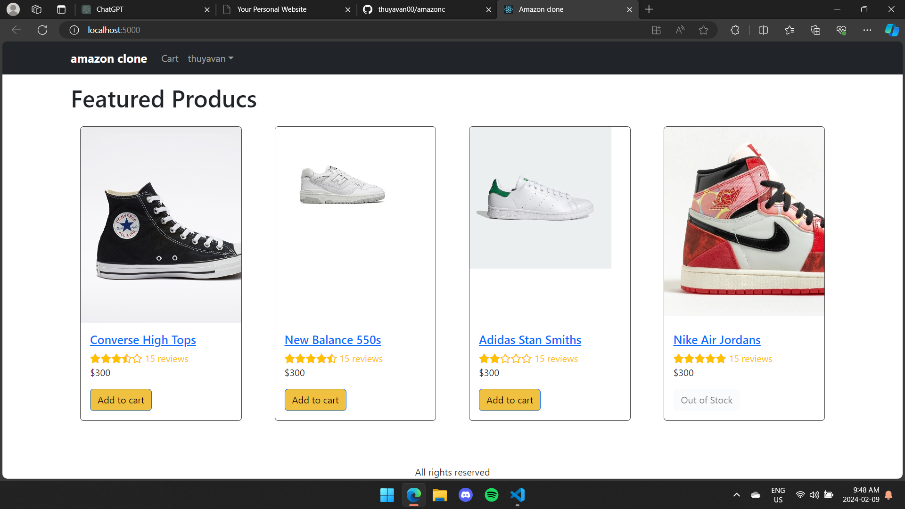
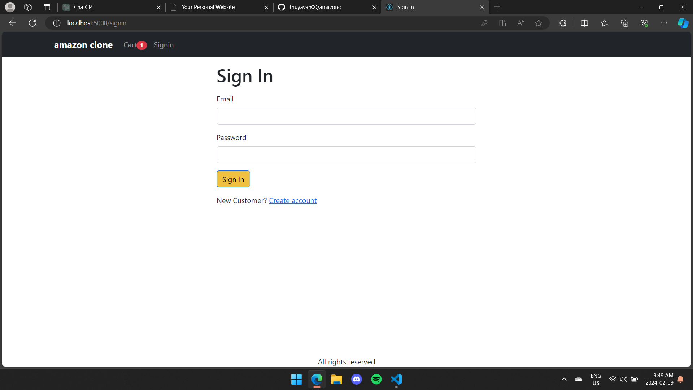
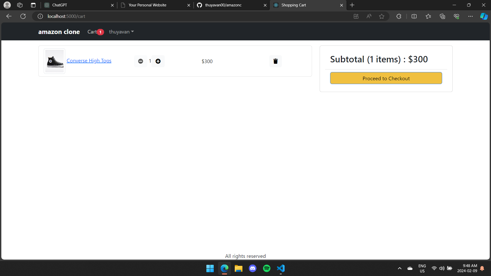
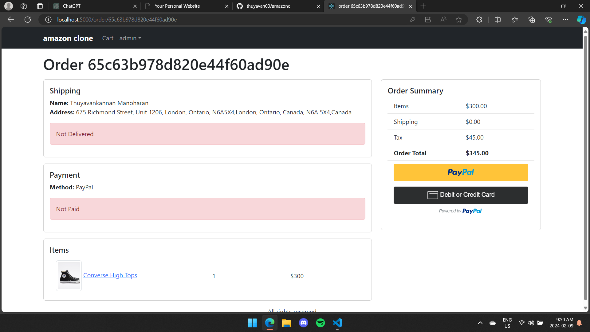
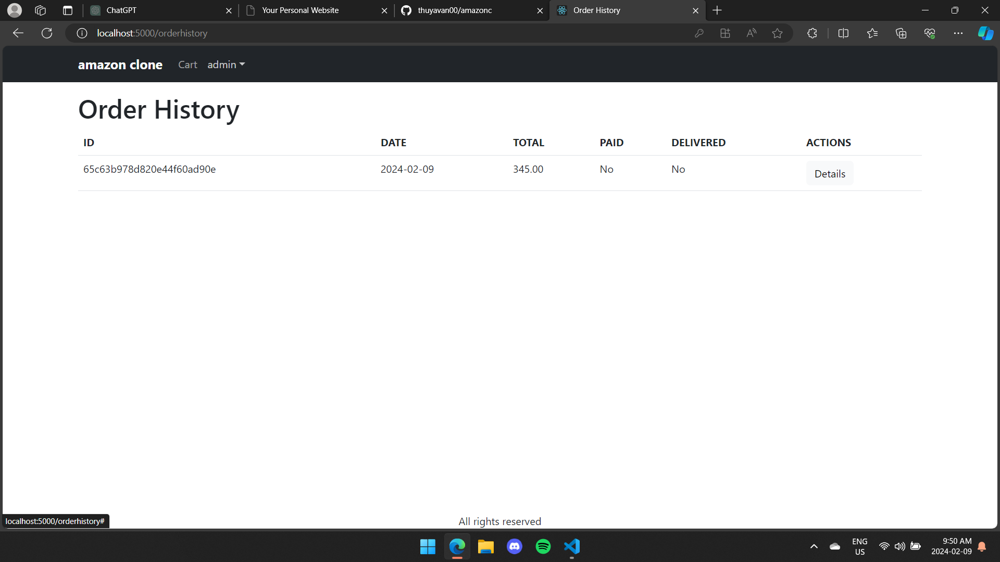

# Amazon Clone E-Commerce Application


## Overview

Welcome to the Amazon Clone, a fully-functional e-commerce web application built using the MERN (MongoDB, Express.js, React, Node.js) stack. This project replicates the core features of the Amazon website, allowing users to browse products, add items to the cart, proceed to checkout, and make purchases securely using PayPal API.

## Features

- **Product Catalog:** Explore a wide range of products with detailed descriptions.
  
- **User Authentication:** Register an account, sign in securely, and manage your profile.
  
- **Shopping Cart:** Add products to your cart, update quantities, and proceed to checkout.
  
- **Checkout Process:** Enter shipping details, review orders, and make secure payments.
  
- **Order History:** View your past orders and track their status.
  

## Technologies Used

- **Frontend:**

  - React
  - Context API (State Management)
  - Bootstrap (UI Components)

- **Backend:**

  - Node.js
  - Express.js
  - MongoDB (Database)
  - Mongoose (ODM)
  - JWT (JSON Web Tokens for authentication)

- **Deployment:**
  - Heroku (Backend)
  - MongoDB Atlas (Database hosting)

## Getting Started

### Prerequisites

- Node.js and npm installed
- MongoDB Atlas account for database setup

### Installation

1. Clone the repository:

   ```bash
   git clone https://github.com/thuyavan00/amazonc
   cd amazonc
   ```

2. Run the project:

   ```bash
   npm start
   ```
